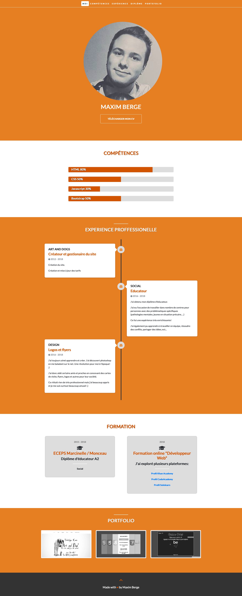

# C.V Template

## What?
A responsive C.V. website.

## Why?
Learning html and css + responsivity.

## How?
This is made with **Html/Css**, **bootstrap** and a some **JavaScript**.

## Screenshot

Have fun with it! :)
